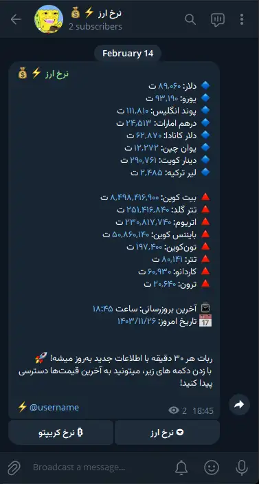
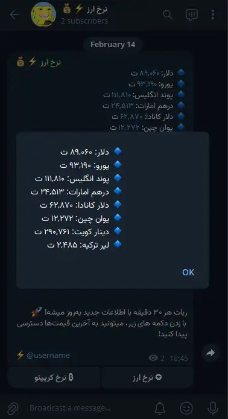

## ⭐ Support
The simplest way to support us is by clicking the star (⭐) at the top of this page

## 💭 About Project

🤖 Currypto Watch A bot for real-time cryptocurrency and currency prices! 💹
Always up-to-date, accurate, and fast! 🚀

## 🖼️ Screeshot

|  |  |
|---------|---------|
|  |  |


## 🚀 Features

✅ **Real-time** cryptocurrency and currency prices  
✅ **Simple** and interactive user interface  
✅ **Fast** and accurate responses  
✅ **Always** up-to-date with the latest market data

## ⚡ **Technologies Used**  
- 🛠 **Programming Language:** Dart  
- 🤖 **Telegram Bot Framework:** [Televerse](https://pub.dev/packages/televerse)  
- 🌐 **API Integration:** [BabakCode API](https://babakcode.com/apps/currency) for real-time cryptocurrency and currency data  

## ⚙️ Installation
### 🧩 **Prerequisites**  
- [**Dart SDK**](https://dart.dev/get-dart) installed  
- A Telegram bot token from [@BotFather](https://t.me/BotFather)
- A Telegram channel where the bot will send updates (make sure the bot is added as an **admin** to the channel) 


### **Setup & Run**  
1. Clone the repository:  
   ```sh
   git clone https://github.com/1tsmhmd/currypto_watch.git
   cd currypto_watch

2. Install dependencies:
    ```sh
    dart pub get

3. Create a .env file and Add Your Telegram Bot Token
    ```sh
    cp .env-example .env   # For Linux/macOS
    copy .env-example .env  # For Windows

4. Then, open the .env file and change the variables:
    ```sh
    TELEGRAM_BOT_TOKEN=your_telegram_bot
    API_KEY=your_babakcode.com_api_key
    TELEGRAM_CHANNEL_USERNAME=your_channel_username

5. Run the bot:
    ```sh
    dart main.dart


## 🤝 Contribute
1. Fork the repository.
2. Make your changes.
3. Submit a Pull Request.


## 📞 Contact
[Telegram](https://itsmhmd)

